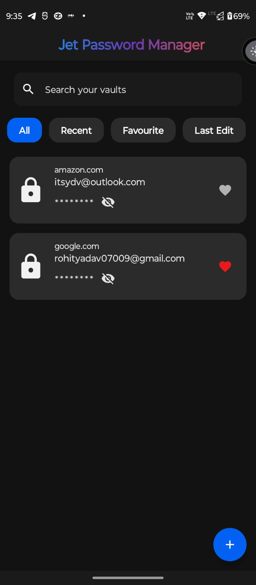
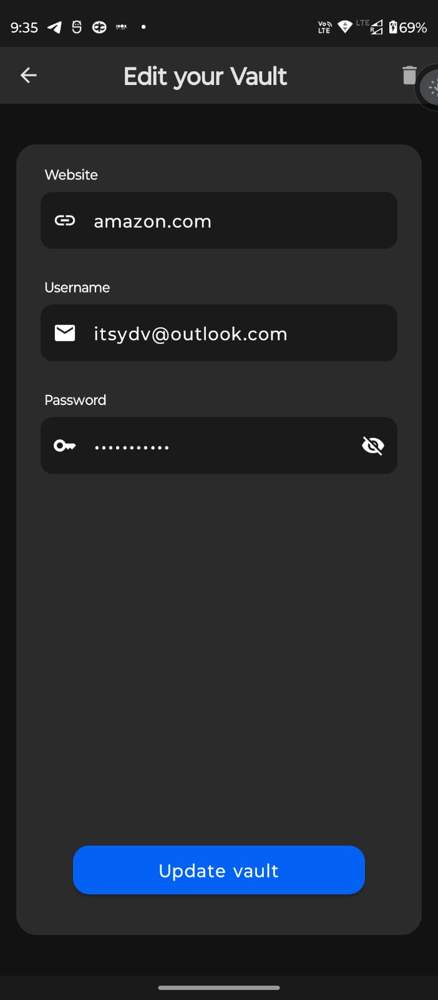
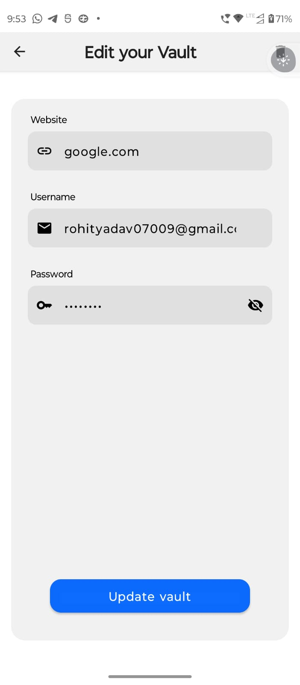

# Jey Password Manager 🤖

This is an Basic Password Manager App based on the Information provided in the GDSC hiring task.

## Screenshots and Videos
    

### Library and Dependencies Used 🔗
- [Kotlin](https://kotlinlang.org)
- Dagger-Hilt for Dependency Injection
- Jetpack Compose
- Room Persistence Library
- Navigation Components
- Coroutines
- Gson Convertor Factory
- ViewBinding

## Known Issues
- None

